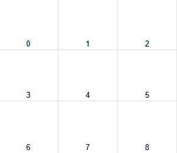

# Sudoku solver

## How to use

This solver does not have any GUI, so you'll have to use the terminal to use it.
It might not be extremely user-friendly, but it is not hard to use:

First, the program will ask how many hints are present in our grid. It then expects you to write down *only* the number of hints, which must be between 0 and 81.

Then, you will be asked, for each hint, in which square it is located (a square being the 3*3 subdivision of the grid). It expects a number between 0 and 8, 0 being the top left corner, 8 being the bottom right corner, with 4 being the central square, 2 the top right one, and 6 the bottom left one. See the image below.

Once the square is entered, you will be prompted with entering the tile of the hint. Once again, a number between 0 and 8 is expected, and the coordinates are the same as for the square.
Finally, you will be prompted with entering the value of the hint, ranging from 1 to 9.

Once you have entered all of this, the program will print the current state of the grid, to help you remember which hints you have already entered, and it will repeat the last three steps until all the hints are written in.
Then, it will compute a solution (not necessarily unique) if one exists, and print it to you.

## Goal

The goal of this program is to solve any given sudoku grid, if a solution exists.
The backtracking algorithm used in this repo is copied from the one I implemented in my [8-Queens Solver](https://github.com/Sanegv/8-Queens-Solver) project, because the steps are basically the same, except that you have to check for sub grids instead of diagonals.

The goal here was to use two concepts:
- backtracking
- Unit Testing (in C)

### Backtracking

A backtracking algorithm is a type of algorithm used to find a solution that satisfies some constraints.
To do so, we iterate over a tree of possibilities, and as soon as one possibility proves to violate a constraint, we eliminate it.

This kind of algorithm is used to solve problems like exploring a labyrinth,finding moves in chess, solving sudoku grids, etc.

### Unit Testing

While not a brand-new concept, I wanted to force myself to do this project properly, and TDD (Test Driven Development) allowed me to gain a lot of time when trying an implementation.
C unit testing is not as advanced as Java's JUnit or Go's Testing, but it is more than enough to create a working TDD environment.

## Sudoku

A sudoku is a well known puzzle, in which we are given a 9*9 grid with a few digits already placed in it.

This grid is also divided in nine 3*3 smaller grids, and to solve a sudoku puzzle, one must fill every tile in such a way that each row, column, and 3*3 square contains one an only one occurrence of each digit.

This is obviously extremely similar to the [N-Queens problem](https://github.com/Sanegv/N-Queens-Solver), that I've already solved. 

## Files

This repository is divided in two main directories.

### [src](./src)

This folder contains all the actual code used for the [sudoku](./src/sudoku.h),the [solver](./src/solver.h), and a [main](./src/main.c) function that finds prints a solution in the terminal.

### [tests](./tests)

This folder holds all the unit tests for all the functions of src 
(except the one that prints the board).

- [unit_tests](./tests/unit_tests.c) has its own main, and calls all the tests of the other files.
- [sudoku_test](./tests/sudoku_test.h) and [solver_test](./tests/solver_test.h) test all the functions defined in [sudoku](./src/sudoku.h) and [solver](./src/solver.h), respectively.